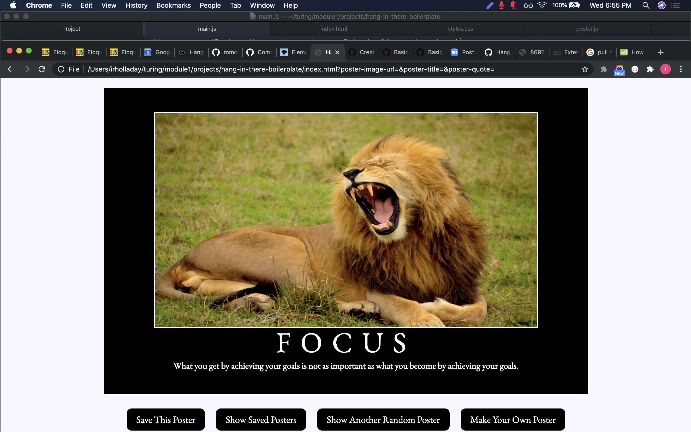
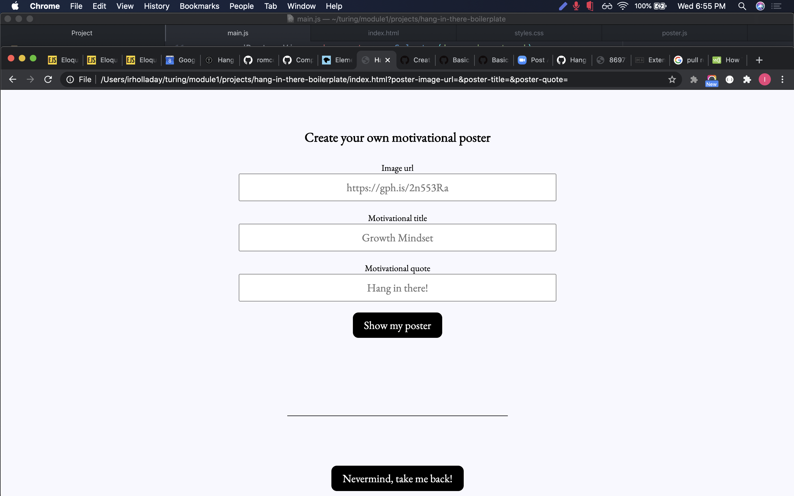
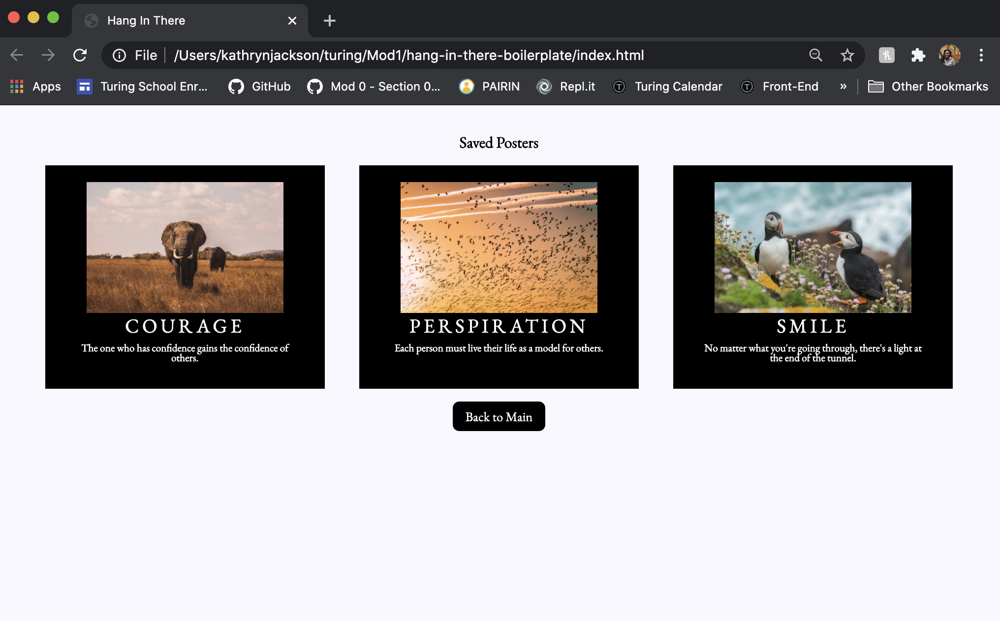
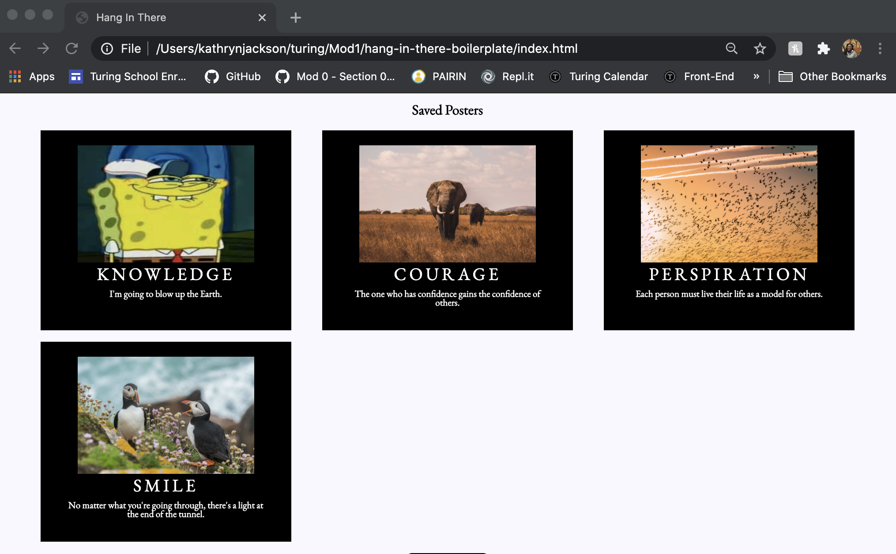
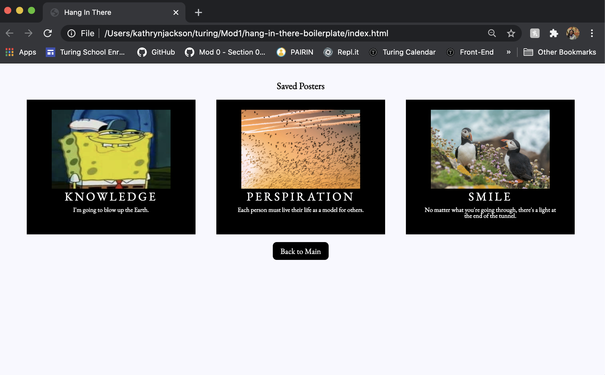

# Hang in there Boilerplate: A Motivational Poster Generator

## Paired Project by Kathryn (KJ) Jackson and Ian Holladay

Turing's 2006 FE week two paired project

## The link to our project can be found here:

https://github.com/kathrynljackson/hang-in-there-boilerplate

## Project Overview

We designed the functionality of a webpage using JavaScript with some HTML. Most of the HTML and all of the CSS were given to us to start out with. Our project goal was to create a webpage that can save, randomize, and take in user input to generate motivational posters. In short, our goals were to:

- Generate random motivational posters
- Create custom covers generated with user input
- Save random and user generated posters
- Viewed saved posters on a separate page
- Delete saved covers

## Learning

- Write clean, DRY JavaScript to store our data
- Use a provided class by creating object instances using the new keyword
- Manipulate the page after it has loaded adding, removing, and updating elements on the DOM
- Understand event bubbling and use event delegation on dynamic elements
- Begin to understand how to write effective, clean HTML & CSS

## Wins

- Having good communication and teamwork (we like working with each other!)
- We both stuck to our schedule fairly strictly, letting us plan out parts of the project efficiently.
- We both feel that we have a better understanding of the git workflow, and how to use git during collaboration.
- Our code was produced efficiently enough to allow us time to work towards level 4 goals according to the rubric.

## Challenges

- We have two different performance levels. Ian has more experience than KJ, we were able to overcome this challenge fairly quickly. This required honesty, and special attention to the balance of workload.
- We had a harder time understanding exactly how to event bubble, as we got to this part in the project before our lesson on this subject.
- Integrating multiple data types (specifically accessing the correct data type).

## Contact us on GitHub at:

https://github.com/kathrynljackson - Kathryn Jackson

https://github.com/holladayian - Ian Holladay

## Pictures & Gifs

This is a picture of our home page. It will load a randomly selected image, title, and quote to create an inspirational poster.
 

 

 This is the User Input View. Users can input their own image, title, and quote to create a personalized inspirational poster.
  
 
  

 Both randomly generated posters and user-created posters can be saved.
  
 
  
 
  

Double clicking on a poster will delete it from the Saved Posters view.
 

 
